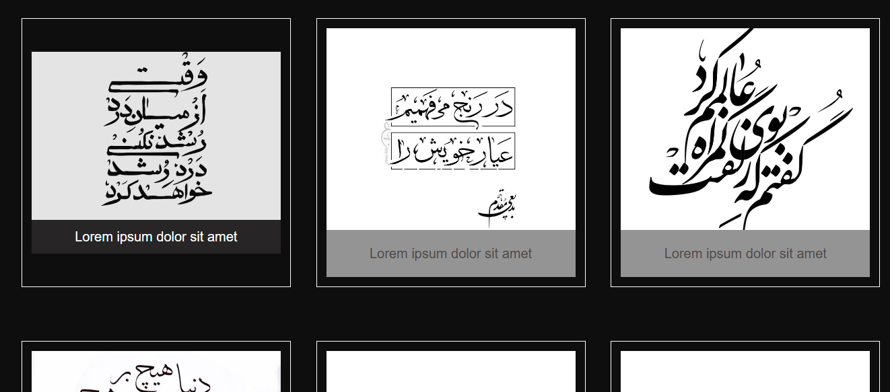

# Responsive-Flex
I created a responsive image gallery using HTML and CSS. The layout uses Flexbox to make a flexible grid that automatically adapts to different screen sizes. Each image has a caption, and a smooth hover effect enlarges the image and highlights the caption for better interaction.

## Features

- Fully **responsive** layout
- **Flexbox** based grid
- Hover effect on images and captions
- Easy to customize

## Demo

Check out the live demo here: https://yasna-aarabi.github.io/Responsive-Flex/
